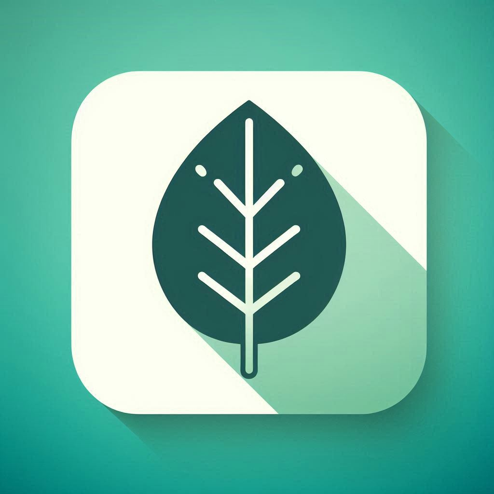
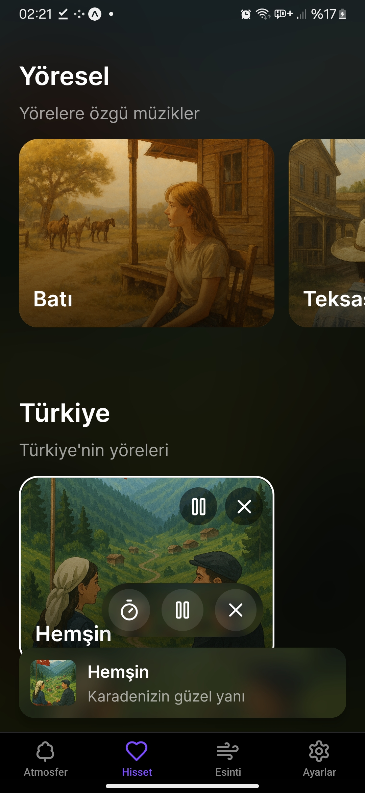
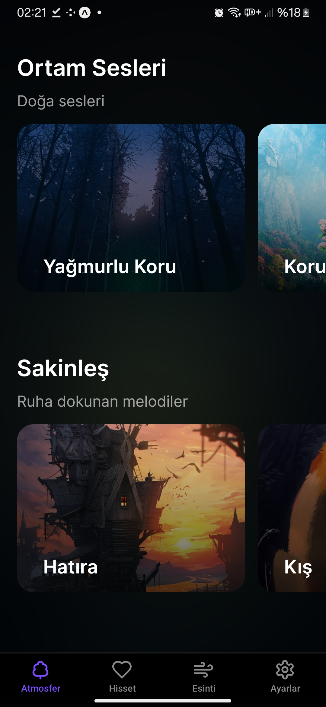
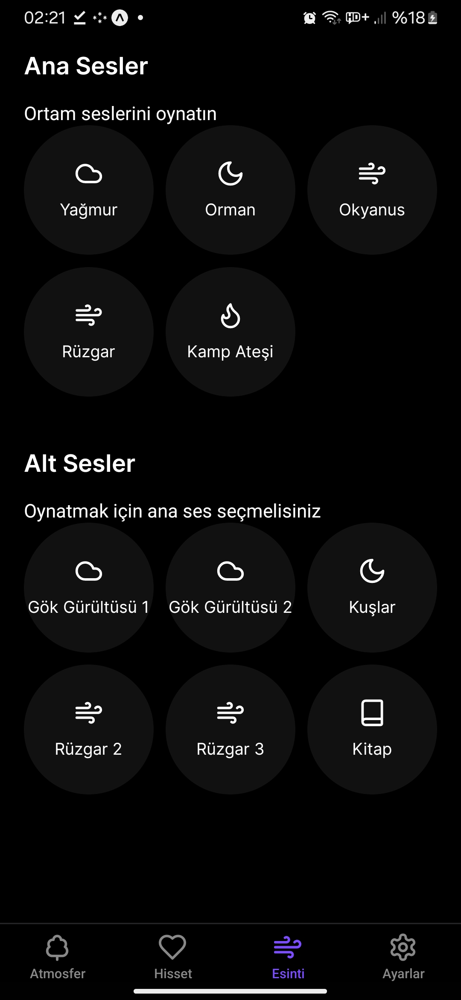
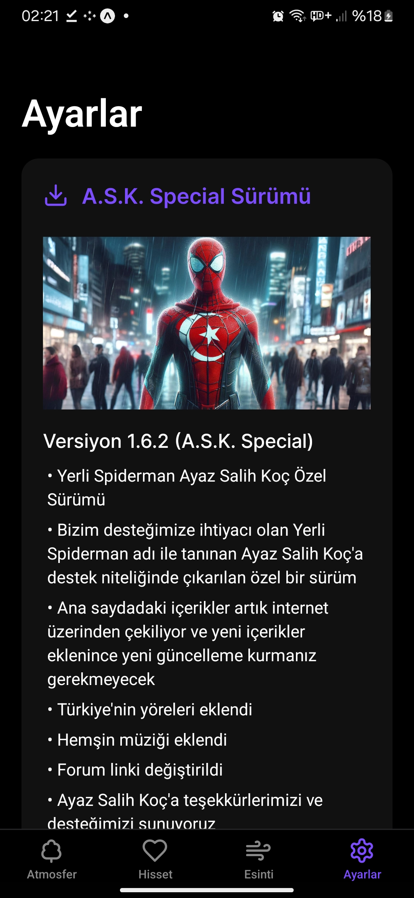
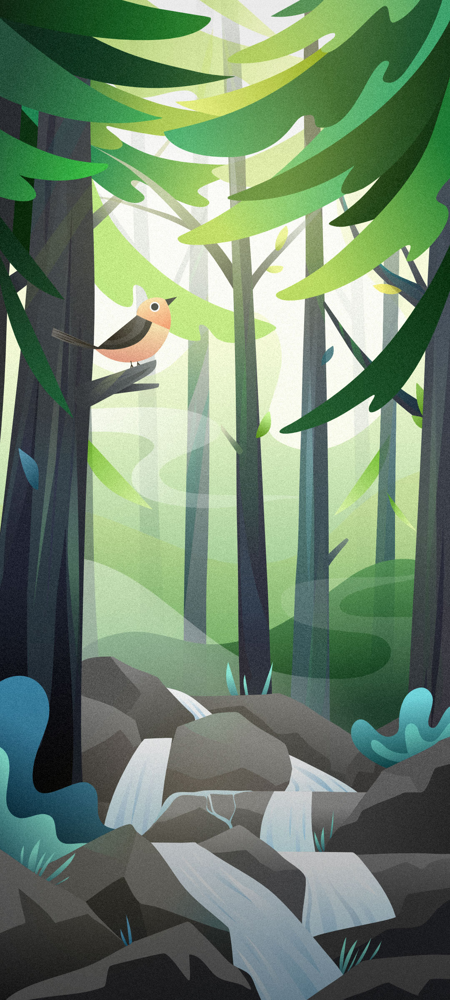

# Asedia

  
   
  <h3>Yeni Nesil Mobil Deneyim</h3>
  
Asedia, modern ve kullanıcı dostu arayüzü ile mobil deneyiminizi yeniden tanımlıyor.

## 📱 Uygulama Hakkında

Asedia, React Native ve Expo teknolojileri kullanılarak geliştirilmiş modern bir mobil uygulamadır. Kullanıcı deneyimini ön planda tutan tasarımı ve güçlü özellikleriyle öne çıkar.

### 🌟 Özellikler

- 🎨 Modern ve şık kullanıcı arayüzü
- 🌙 Karanlık mod desteği
- 🔔 Bildirim sistemi
- 📱 Android için tam destek

### 📸 Ekran Görüntüleri

  

    
    
    
    
    
    
  

📱 Daha fazla ekran görüntüsü

| Ana Ekran | Medya Oynatıcı | Profil |
|-----------|----------------|---------|
|  |  |  |

## 🚀 Kurulum

### Gereksinimler

- Node.js (v14 veya üzeri)
- npm veya yarn
- Expo CLI
- iOS için Xcode (iOS geliştirmesi için)
- Android için Android Studio (Android geliştirmesi için)

### Kurulum Adımları

1. Repoyu klonlayın:
\`\`\`bash
git clone https://github.com/your-username/asedia.git
cd asedia
\`\`\`

2. Bağımlılıkları yükleyin:
\`\`\`bash
npm install
# veya
yarn install
\`\`\`

3. Uygulamayı başlatın:
\`\`\`bash
npm run dev
# veya
yarn dev
\`\`\`

## 🛠️ Geliştirme

### Kullanılan Teknolojiler

- React Native
- Expo
- TypeScript
- React Navigation
- Expo Router
- Ve daha fazlası...

### Proje Yapısı

\`\`\`
asedia/
├── app/           # Ana uygulama kodları
├── assets/        # Resimler, fontlar ve diğer medya dosyaları
├── components/    # Yeniden kullanılabilir bileşenler
├── hooks/         # Custom React hooks
└── ...
\`\`\`

## 📦 Dağıtım

### Android için Build

\`\`\`bash
npm run android
# veya
yarn android
\`\`\`

### iOS için Build

\`\`\`bash
npm run ios
# veya
yarn ios
\`\`\`

## 🤝 Katkıda Bulunma

1. Bu repoyu fork edin
2. Yeni bir branch oluşturun (\`git checkout -b feature/amazing-feature\`)
3. Değişikliklerinizi commit edin (\`git commit -m 'Add some amazing feature'\`)
4. Branch'inize push edin (\`git push origin feature/amazing-feature\`)
5. Pull Request oluşturun

## 📄 Lisans

Bu proje GNU General Public License v3.0 (GPL-3.0) lisansı altında lisanslanmıştır. Detaylı bilgi için [LICENSE](LICENSE) dosyasını inceleyebilirsiniz.

## 📞 İletişim

Sorularınız veya geri bildirimleriniz için:

- Website: [https://asedia.app](https://asedia.app)
- Email: contact@asedia.app
- Twitter: [@AsediaApp](https://twitter.com/AsediaApp)

---

  
Made with ❤️ by Nexa Team

 